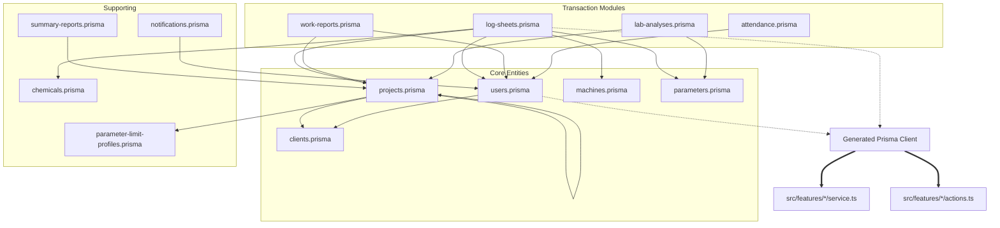

# M-01: Database Schema — Dependency Map

> Generated: 2026-03-07

---

## 1. File Inventory

### Schema Layer (Prisma)

| #   | File                                          | Lines | Role                          |
| --- | --------------------------------------------- | ----: | ----------------------------- |
| 1   | prisma/schema/attendance.prisma               |    24 | Attendance tracking           |
| 2   | prisma/schema/chemicals.prisma                |    42 | Chemical inventory & usage    |
| 3   | prisma/schema/clients.prisma                  |    21 | Client & Billing entities     |
| 4   | prisma/schema/lab-analyses.prisma             |    80 | Lab testing data              |
| 5   | prisma/schema/log-sheets.prisma               |   125 | Core data entry (Central)     |
| 6   | prisma/schema/machines.prisma                 |    46 | Asset management              |
| 7   | prisma/schema/notifications.prisma            |    31 | System alerts                 |
| 8   | prisma/schema/parameter-limit-profiles.prisma |    41 | Threshold configurations      |
| 9   | prisma/schema/parameters.prisma               |    45 | Chemical/Physical parameters  |
| 10  | prisma/schema/projects.prisma                 |   118 | Site & Contract management    |
| 11  | prisma/schema/schema.prisma                   |    12 | Prisma global config          |
| 12  | prisma/schema/summary-reports.prisma          |    39 | Monthly reporting aggregation |
| 13  | prisma/schema/users.prisma                    |    62 | Identity & RBAC               |
| 14  | prisma/schema/work-reports.prisma             |    72 | Service & Maintenance logs    |

---

## 2. Dependency Graph (Mermaid)

---

## 3. Circular Dependency Analysis

**Result: 0 module-level circular dependencies.**
*Prisma handles self-referencing and cross-file relations at the database level. No application-level circularities detected within the schema definitions.*

---

## 4. God Files / Oversized Files

| File | Lines | Models | Verdict |
| :--- | :---: | :---: | :--- |
| `log-sheets.prisma` | 125 | 4 | **GOD MODULE** (Central nexus for 5 domains) |
| `projects.prisma` | 118 | 3 | **DOMAIN HUB** (Site, Assignment, Overrides) |

---

## 5. Duplicated Code Blocks

| ID | Description | Locations | Status |
| :--- | :--- | :--- | :--- |
| DUP-1 | Soft-delete `deletedAt` field | All models except Enums | **Strategy** |
| DUP-2 | Timestamp fields `createdAt`, `updatedAt` | All models | **Strategy** |

---

## 6. Cross-Module Impact

**⚠️ External modules this module imports from or is imported by:**

| Direction | External Module | Files Affected | Impact |
| :--- | :--- | :--- | :--- |
| **Imported By** | All Feature Services | `src/features/*/service.ts` | **TOTAL**. Every service depends on the types/client generated from this schema. |
| **Imported By** | All Repository Layers | `src/features/*/repository.ts` | Primary data access dependency. |
| **Imported By** | Auth Middleware | `src/middleware.ts` | Depends on `User` and `UserRole` enums. |
| **Imported By** | Form Schemas | `src/features/*/validation.ts` | Zod schemas reflect these DB constraints. |

**Rule:** Any change to M-01 schemas MUST be followed by `npx prisma generate` and a full project build check (`npm run build`) to identify breaking type changes in downstream modules.
