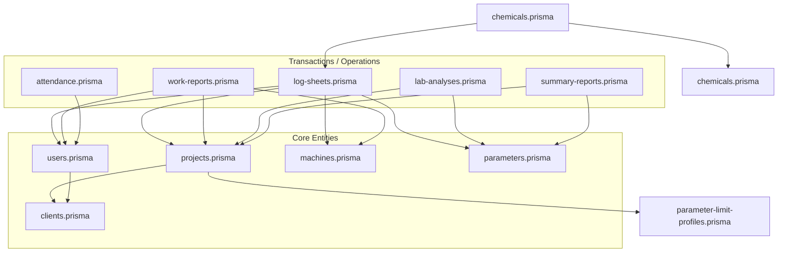

# M-01: Database Schema — Dependency Map

> Generated: 2026-03-04

---

## 1. File Inventory

### Domain Schemas

| #   | File                                          | Lines | Role                                  |
| --- | --------------------------------------------- | ----: | ------------------------------------- |
| 1   | prisma/schema/attendance.prisma               |    24 | Attendance tracking                   |
| 2   | prisma/schema/chemicals.prisma                |    42 | Chemical inventory & usage            |
| 3   | prisma/schema/clients.prisma                  |    20 | Client management                     |
| 4   | prisma/schema/lab-analyses.prisma             |    80 | Lab analysis results                  |
| 5   | prisma/schema/log-sheets.prisma               |   123 | Daily log sheets & entries            |
| 6   | prisma/schema/machines.prisma                 |    46 | Machine/Asset management              |
| 7   | prisma/schema/notifications.prisma            |    30 | System notifications                  |
| 8   | prisma/schema/parameter-limit-profiles.prisma |    41 | Parameter limits per project/profile  |
| 9   | prisma/schema/parameters.prisma               |    45 | Parameter definitions                 |
| 10  | prisma/schema/projects.prisma                 |   118 | Project core & assignments            |
| 11  | prisma/schema/schema.prisma                   |    12 | Prisma configuration                  |
| 12  | prisma/schema/summary-reports.prisma          |    38 | Monthly summary reports               |
| 13  | prisma/schema/users.prisma                    |    61 | User management & auth                |
| 14  | prisma/schema/work-reports.prisma             |    72 | Service work reports                  |

---

## 2. Dependency Graph (Mermaid)

---

## 3. Circular Dependency Analysis

**Result: High number of circular references between models.**
Prisma handles these at the database level, but they indicate tight domain coupling.

| ID   | Cycle Path                      | Severity | Resolution                                     |
| ---- | ------------------------------- | -------- | ---------------------------------------------- |
| CD-1 | User <-> Client                 | Medium   | User belongs to Client; Client has users       |
| CD-2 | Project <-> Client              | Medium   | Project for Client; Client has projects        |
| CD-3 | LogSheet <-> User               | High     | LogSheet signed/submitted by User; User has many LogSheets (5 different relations) |
| CD-4 | Project <-> Machine             | Medium   | Machine in Project; Project has machines       |
| CD-5 | Project <-> LogSheet            | Medium   | LogSheet in Project; Project has LogSheets     |

---

## 4. God Classes / Oversized Files (at Schema level)

While no file exceeds 300 lines, the following models act as "God Models" due to high incoming/outgoing relations:

| File              | Lines | Models | Verdict           |
| ----------------- | ----: | :----: | ----------------- |
| log-sheets.prisma |   123 |    4   | **GOD DOMAIN**    |
| projects.prisma   |   118 |    3   | **GOD DOMAIN**    |
| users.prisma      |    61 |    1   | **CORE ANCHOR**   |

---

## 5. Duplicated Code Blocks (Patterns)

| ID    | Description                   | Locations        | Status |
| ----- | ----------------------------- | ---------------- | ------ |
| DUP-1 | Soft-delete fields            | Most files       | OPEN   |
| DUP-2 | Timestamps (createdAt/Update) | All files        | OPEN   |
| DUP-3 | Signature/Approval logic      | log-sheets, work-reports | OPEN   |
| DUP-4 | Photo/File attachment pattern | log-sheets, work-reports | OPEN   |
