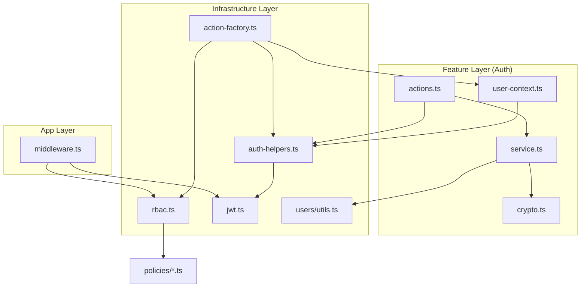

# M-02: Auth & Middleware — Dependency Map

> Generated: 2026-03-07

---

## 1. File Inventory

### App Layer (Routing & Middleware)

| #   | File              | Lines | Role                                      |
| --- | ----------------- | ----: | ----------------------------------------- |
| 1   | src/middleware.ts |    67 | Next.js Edge Middleware for global auth/RBAC |

### Feature Layer (Auth Domain)

| #   | File                                  | Lines | Role                                      |
| --- | ------------------------------------- | ----: | ----------------------------------------- |
| 1   | src/features/auth/actions.ts          |    71 | Public Server Actions (Login/Logout)      |
| 2   | src/features/auth/service.ts          |    82 | Auth business logic & Prisma interaction  |
| 3   | src/features/auth/crypto.ts           |    46 | Password hashing & comparison primitives  |
| 4   | src/features/auth/constants.ts        |    35 | Auth domain constants & routes            |
| 5   | src/features/auth/lib/user-context.ts |    59 | Server-side user identity resolution      |

### Infrastructure Layer (Security Helpers)

| #   | File                                  | Lines | Role                                      |
| --- | ------------------------------------- | ----: | ----------------------------------------- |
| 1   | src/lib/rbac.ts                       |   121 | Core RBAC Registry & Access Checks        |
| 2   | src/lib/jwt.ts                        |    96 | JWT utilities (jose-based)                |
| 3   | src/lib/auth-helpers.ts               |    72 | Shared session & cookie helpers           |
| 4   | src/lib/action-factory.ts             |   111 | Type-safe Server Action Factory           |
| 5   | src/lib/rbac/types.ts                 |    46 | RBAC type definitions                     |
| 6   | src/lib/rbac/policies/*.ts            |   164 | Granular role-based policies (3 files)    |
| 7   | src/features/users/utils.ts           |    59 | Shared user mappers & auth status guards  |

---

## 2. Dependency Graph (Mermaid)

---

## 3. Circular Dependency Analysis

**Result: 0 module-level circular dependencies.**

| ID   | Cycle Path | Severity | Resolution |
| ---- | ---------- | -------- | ---------- |
| None | -          | -        | -          |

---

## 4. God Classes / Oversized Files

| File | Lines | Exports | Verdict |
| ---- | ----: | :-----: | ------- |
| None |     0 |    0    | All files are small (< 150 lines) |

---

## 5. Duplicated Code Blocks

| ID    | Description                                      | Locations                       | Status |
| ----- | ------------------------------------------------ | ------------------------------- | ------ |
| DUP-1 | `JWT_SECRET` retrieval & encoding                 | `lib/jwt.ts`, `lib/auth-helpers.ts` (Partial) | Fixed  |
| DUP-2 | User account status check (blocked/inactive)     | `service.ts`, `users/utils.ts`  | Fixed  |

---

## 6. Cross-Module Impact

**⚠️ External modules this module imports from or is imported by:**

| Direction       | External Module            | Files Affected | Impact                                    |
| --------------- | -------------------------- | -------------- | ----------------------------------------- |
| **Imports**     | `@/lib/prisma`             | `service.ts`   | Fetches user data for authentication      |
| **Imported By** | All Feature Modules        | `actions.ts`   | Use `actionFactory` for protected actions |
| **Imported By** | All Feature Modules        | `service.ts`   | Use `requireActor` / `ensureAccess`       |
| **Imported By** | Layout Components          | `nav.tsx`      | Use `filterNavItems` for conditional UI   |

**Rule:** M-02 is the **security anchor** of the system. Any changes to `rbac.ts`, `jwt.ts`, or `action-factory.ts` have system-wide impact. All refactoring in this module MUST be verified against the global test suite.
