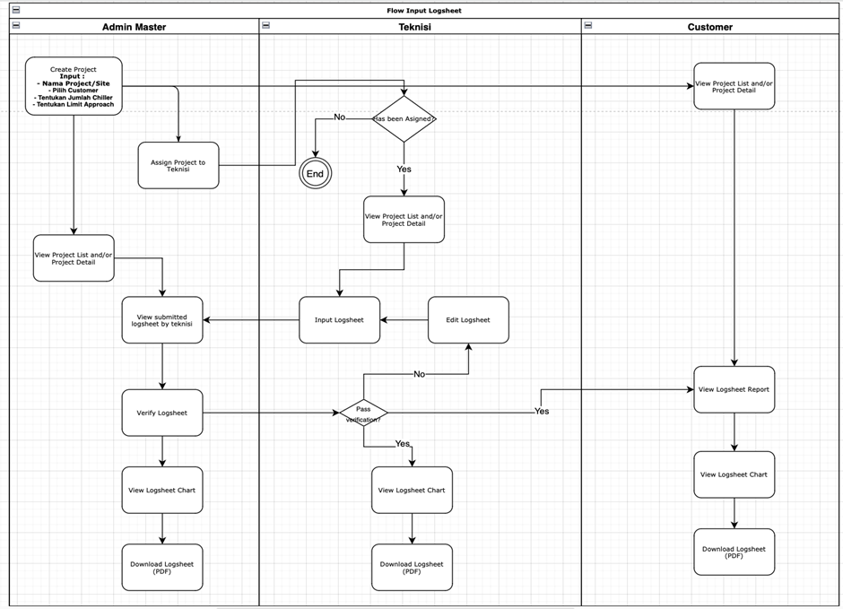
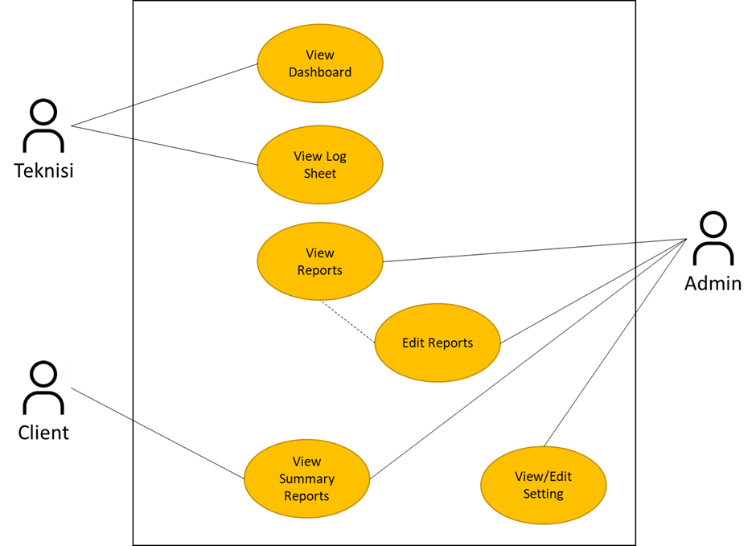
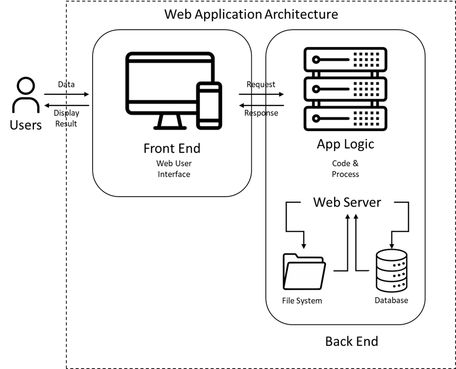

# Corintek Project Information System (CPIS) Web Application

> **Last Updated:** 2026-03-04
> **Legend:**
>
> - **[IMPLEMENTED]** = Feature is built and functional
> - **[NOT IMPLEMENTED]** = Feature is in FSD but NOT built
> - **[IMPLEMENTED - PARTIAL]** = Feature is partially built

---

## 1. Deskripsi Proyek

Pengembangan Corintek Project Information System (CPIS) bertujuan untuk membangun sebuah sistem informasi yang dapat memfasilitasi informasi, laporan dan manajemen proyek secara efektif dan efisien. Sistem ini akan menyediakan platform terintegrasi untuk pengumpulan data, analisis, pemantauan, dan pelaporan proyek yang sedang berjalan maupun yang telah selesai. Dengan adanya sistem ini, diharapkan proyek yang ditangani PT. Corintek Inti Sejahtera (CORINTEK) dapat dikelola dengan lebih baik, mengoptimalkan penggunaan sumber daya, meningkatkan koordinasi tim, dan memastikan kelancaran dalam pencapaian tujuan proyek.

## 2. Gambaran Umum Sistem

CPIS akan menjadi pusat kontrol utama untuk manajemen proyek yang dikerjakan CORINTEK. Aplikasi Web ini akan memiliki fitur-fitur seperti manajemen tugas, pemantauan jadwal, kolaborasi tim, pelaporan proyek, dan manajemen risiko. Aplikasi ini akan bersifat web-based sehingga dapat diakses oleh pengguna dari berbagai lokasi dengan menggunakan perangkat yang terhubung ke internet.

Melalui Sistem Informasi Proyek, pengguna akan dapat mengakses informasi proyek secara real-time, mengelola tugas-tugas yang terkait dengan proyek, memantau kemajuan proyek, berkolaborasi dengan tim, serta mengidentifikasi dan mengelola risiko yang mungkin muncul selama proyek berlangsung. Aplikasi ini juga akan menyediakan laporan yang informatif dan visualisasi data yang membantu pengambilan keputusan yang lebih baik oleh manajemen proyek.

Dengan adanya Sistem Informasi Proyek, diharapkan tercapainya efisiensi dan efektivitas dalam manajemen proyek, peningkatan transparansi informasi, pengurangan kesalahan manusia, dan peningkatan kualitas dalam pengambilan keputusan proyek.

## 3. Kebutuhan Bisnis

CPIS akan melibatkan pemangku kepentingan berikut:

- Admin master: Membutuhkan akses real-time terhadap informasi proyek, kemampuan untuk memantau kemajuan proyek, dan menerima laporan yang akurat.
- Teknisi: Memerlukan platform kolaborasi yang memungkinkan mereka untuk berbagi informasi, mengelola tugas, dan membuat laporan secara efektif.
- Klien: Membutuhkan antarmuka pengguna yang intuitif dan mudah digunakan untuk mengakses informasi proyek yang relevan.
- Manajemen senior: Membutuhkan laporan dan analisis proyek yang komprehensif untuk pengambilan keputusan strategis.

Kebutuhan bisnis ini harus dipenuhi untuk memastikan bahwa Sistem Informasi Proyek memberikan nilai tambah yang signifikan bagi organisasi, memperbaiki efisiensi operasional, meningkatkan pengelolaan proyek, dan mengoptimalkan penggunaan sumber daya.

## 4. Berikut adalah daftar halaman utama yang akan ada dalam CPIS:

1. Dashboard **[IMPLEMENTED]**
   Fitur dashboard akan memuat:
   - Data chart yang memberikan visualisasi data logsheet historis pada proyek yang sedang dibuka. Data yang ditampilkan dalam chart grafik **[IMPLEMENTED]**:
     - Data Approach Unit Condenser **[IMPLEMENTED]**
     - Data Ampere Unit Condenser **[IMPLEMENTED]**
     - Data Approach Unit Evaporator **[IMPLEMENTED]**
     - Data Ampere Unit Evaporator **[IMPLEMENTED]**
   - Gallery foto yang menampilkan foto-foto yang diambil saat pengisian Logsheet, diurutkan dari tanggal terbaru **[IMPLEMENTED]**.
   - Recent Activity Feed dengan filter 7d/30d dan RBAC **[IMPLEMENTED]**.
   - Parameter akan menampilkan data parameter yang diaplikasikan pada proyek terkait **[NOT IMPLEMENTED]**.

2. Summary Reports **[IMPLEMENTED]**
   - Menampilkan laporan keseluruhan pada akhir periode proyek terkait **[IMPLEMENTED]**.
   - Menampilkan daftar proyek keseluruhan bagi internal **[IMPLEMENTED]**.
   - Menampilkan daftar proyek terbatas bagi klien **[IMPLEMENTED]**.
   - Admin atau internal dapat melakukan upload file scan PDF pada bagian **[IMPLEMENTED]**:
     _ Data temuan **[IMPLEMENTED]**
     _ Data blowdown silang **[IMPLEMENTED]**
     _ Data suhu **[IMPLEMENTED]**
     _ Data surat jalan **[IMPLEMENTED]**
     Data scan PDF akan ditampilkan pada bagian dari summary reports akhir **[IMPLEMENTED]**.

3. Form Laporan Kerja (Logsheet) **[IMPLEMENTED]**

   Log Sheet Daily/Weekly/Scheduled **[IMPLEMENTED]**
   Adminstrasi pilih jenis unit **[IMPLEMENTED]**
   - Unit Condenser \* **[IMPLEMENTED]**
   - Unit Evaporator \* **[IMPLEMENTED]**
   - Check Water Quality \*\* **[IMPLEMENTED]**
   - General Condition \*\* **[IMPLEMENTED]**
   - Job Description \*\* **[IMPLEMENTED]**
   - Consumption Water Meter **[IMPLEMENTED]**
   - Fill Up Chemical **\* **[IMPLEMENTED]\*\*
   - Note **[IMPLEMENTED]**

   Pengisian Log Sheet disesuaikan pada **[IMPLEMENTED]**:
   - (\*) Semua Unit Chiller **[IMPLEMENTED]**
   - (**) Semua Unit Cooling Tower **[IMPLEMENTED]\*\*
   - (**\*) Jenis / nama chemical yang digunakan dan Unit Cooling Tower **[IMPLEMENTED]\*\*

   Log Sheet Request **[NOT IMPLEMENTED]**
   - Situasi Saat Ini **[NOT IMPLEMENTED]**
   - Pekerjaan yang Dilakukan **[NOT IMPLEMENTED]**
   - Hasil Pekerjaan **[NOT IMPLEMENTED]**

   Dengan fitur **[IMPLEMENTED]**:
   - Kemampuan untuk mengisi dan menyimpan data logsheet ke database CPIS **[IMPLEMENTED]**.
   - Pengisian parsial dan dapat disimpan sebagai draft **[IMPLEMENTED]**
   - Pengisian data lapangan, dengan format teks dan angka desimal, dan dengan validasi **[IMPLEMENTED]**:
     - Parameter Limit **[IMPLEMENTED]**
     - Batasan Minimal dan Maksimal **[IMPLEMENTED]**
   - Mengunggah lampiran berupa foto sebelum dan sesudah **[IMPLEMENTED]**.
   - Mengunggah lampiran video sebelum dan sesudah (opsional) **[NOT IMPLEMENTED]**.
     Pada menu Logsheet juga disediakan fitur untuk laporan teknisi yang tidak bisa masuk dan dapat digantikan **[IMPLEMENTED]**

4. Daftar Laporan (Reports) **[IMPLEMENTED]**

   Fitur daftar laporan akan memberikan **[IMPLEMENTED]**:
   - Tampilan yang memuat data logsheet yang telah diinputkan **[IMPLEMENTED]**.
   - Kemampuan untuk menyortir, mencari, dan memfilter laporan berdasarkan klien, proyek, dan tanggal **[IMPLEMENTED]**.

5. Hasil Analisa Lab **[IMPLEMENTED]**

   Berupa form isian data hasil Analisa lab yang diisi oleh internal **[IMPLEMENTED]**.

6. Absensi **[IMPLEMENTED]**

   Melingkupi fungsi absensi **[IMPLEMENTED]**:
   - Fitur absensi bagi teknisi **[IMPLEMENTED]**
   - Absensi masuk : mencatat waktu masuk dengan validasi foto **[IMPLEMENTED]**
   - Absensi keluar : mencatan waktu keluar dengan validasi foto **[IMPLEMENTED]**
   - Total jam kerja (Absensi Keluar - Absensi Masuk) **[IMPLEMENTED]**
   - Export Data Excel **[NOT IMPLEMENTED]** - CSV only

7. Administrasi **[IMPLEMENTED]**:
   1. Manajemen Proyek (CRUD) **[IMPLEMENTED]**

      Fitur manajemen proyek akan memungkinkan **[IMPLEMENTED]**:
      - Pembuatan proyek baru dengan mengisi detail seperti nama proyek, deskripsi, dan tim yang terlibat **[IMPLEMENTED]**.
      - Pembaruan informasi proyek seperti status, tanggal mulai, atau tanggal selesai **[IMPLEMENTED]**.
      - Menghapus proyek yang sudah selesai atau tidak relevan **[IMPLEMENTED]**.
      - Pengaturan parameter Log sheet (limit, Batasan minimal dan maksimal, daftar mesin) untuk proyek **[IMPLEMENTED]**
      - Addendum project support **[IMPLEMENTED]**

   2. Manajemen User **[IMPLEMENTED]**

      Fitur manajemen user akan melibatkan **[IMPLEMENTED]**:
      - Pembuatan akun pengguna baru dengan mengatur username dan password **[IMPLEMENTED]**.
      - Penetapan peran atau hak akses untuk setiap pengguna, seperti admin, teknisi, atau klien **[IMPLEMENTED]**.
      - Pengelolaan informasi pengguna seperti nama, alamat email, dan kontak untuk internal **[IMPLEMENTED]**.
      - Pengelolaan informasi pengguna seperti nama, alamat email, kontak, dana nama perusahaan untuk eksternal (Klien) **[IMPLEMENTED]**.
      - Avatar upload ke R2 storage **[IMPLEMENTED]**

   3. Setting Master **[IMPLEMENTED - PARTIAL]**

      Fitur setting akan mencakup **[IMPLEMENTED - PARTIAL]**:
      - Pengaturan Log Sheet (Master) **[NOT IMPLEMENTED]** - Configuration is per-project
      - Pengaturan Daftar Mesin (Master) **[NOT IMPLEMENTED]** - Machines managed via Projects only
      - Pengaturan Daftar Parameter (Master) **[IMPLEMENTED]** - Full CRUD at `/parameters`

   Berikut adalah daftar fitur yang akan disediakan di dalam CPIS:
   1. Notifikasi **[IMPLEMENTED]**

      Notifikasi yang menampilkan pemberitahuan terkait data angka isian logsheet yang
      di atas/bawah limit parameter normal dan butuh perhatian dari teknisi **[IMPLEMENTED]**.

   2. Tanda tangan digital **[IMPLEMENTED]**

      Fitur untuk tanda tangan pada form web logsheet **[IMPLEMENTED]**.
      - Log Sheet signatures (Technician + Client) **[IMPLEMENTED]**
      - Work Report signatures **[IMPLEMENTED]**

   3. My Profile **[IMPLEMENTED]**

      Fitur my profile akan memungkinkan pengguna untuk **[IMPLEMENTED]**:
      - Melihat informasi profil **[IMPLEMENTED]**.
      - Melihat proyek yang terkait dengan pengguna dan peran yang ditugaskan **[IMPLEMENTED]**.
      - Edit profile data **[IMPLEMENTED]**
      - Avatar upload **[IMPLEMENTED]**

## 5. Alur Kerja

## 6. Use Case

## 7. Arsitektur Sistem

## 8. Aturan Bisnis

### A. Log Sheet / Weekly / Scheduled Form

<table>
<thead>
<tr>
<th>Field</th>
<th>Field Type</th>
<th>Parameter Limit</th>
<th>Validasi Rentang</th>
<th>Required</th>
</tr>
</thead>
<tbody>
  <tr>
    <td colspan="5">Administrasi</td>
  </tr>
  <tr>
    <td>Tanggal</td>
    <td>Date</td>
    <td>-</td>
    <td>-</td>
    <td>Yes</td>
  </tr>
  <tr>
    <td>Zone</td>
    <td>Text</td>
    <td>-</td>
    <td>-</td>
    <td>No</td>
  </tr>
  <tr>
    <td>unit</td>
    <td>Checkbox (Button)</td>
    <td>-</td>
    <td>-</td>
    <td>Yes (Min. 1)</td>
  </tr>
  <tr>
    <td colspan="5">Unit Condenser</td>
  </tr>
  <tr>
    <td>Temp (°C) In</td>
    <td>Number (Desimal)</td>
    <td>Ada nilai default, namun ada opsi untuk diubah per proyek</td>
    <td>Ada rentang batas minimum dan maksimum angka wajar pengisian</td>
    <td>Yes</td>
  </tr>
  <tr>
    <td>Temp (°C) Out</td>
    <td>Number (Desimal)</td>
    <td>Ada nilai default, namun ada opsi untuk diubah per proyek</td>
    <td>Ada rentang batas minimum dan maksimum angka wajar pengisian</td>
    <td>Yes</td>
  </tr>
  <tr>
    <td>Saturated Temp (°C)</td>
    <td>Number (Desimal)</td>
    <td>Ada nilai default, namun ada opsi untuk diubah per proyek</td>
    <td>Ada rentang batas minimum dan maksimum angka wajar pengisian</td>
    <td>Yes</td>
  </tr>
  <tr>
    <td>Approach (°C)</td>
    <td>Number (Desimal)</td>
    <td>Ada nilai default, namun ada opsi untuk diubah per proyek</td>
    <td>Ada rentang batas minimum dan maksimum angka wajar pengisian</td>
    <td>Yes</td>
  </tr>
  <tr>
    <td>Load Demand</td>
    <td>Number (Desimal)</td>
    <td>Ada nilai default, namun ada opsi untuk diubah per proyek</td>
    <td>Ada rentang batas minimum dan maksimum angka wajar pengisian</td>
    <td>Yes</td>
  </tr>
   <tr>
    <td colspan="5">Unit Evaporator</td>
  </tr>
  <tr>
    <td>Temp (°C) In</td>
    <td>Number (Desimal)</td>
    <td>Ada nilai default, namun ada opsi untuk diubah per proyek</td>
    <td>Ada rentang batas minimum dan maksimum angka wajar pengisian</td>
    <td>Yes</td>
  </tr>
  <tr>
    <td>Temp (°C) Out</td>
    <td>Number (Desimal)</td>
    <td>Ada nilai default, namun ada opsi untuk diubah per proyek</td>
    <td>Ada rentang batas minimum dan maksimum angka wajar pengisian</td>
    <td>Yes</td>
  </tr>
  <tr>
    <td>Saturated Temp (°C)</td>
    <td>Number (Desimal)</td>
    <td>Ada nilai default, namun ada opsi untuk diubah per proyek</td>
    <td>Ada rentang batas minimum dan maksimum angka wajar pengisian</td>
    <td>Yes</td>
  </tr>
  <tr>
    <td>Approach (°C)</td>
    <td>Number (Desimal)</td>
    <td>Ada nilai default, namun ada opsi untuk diubah per proyek</td>
    <td>Ada rentang batas minimum dan maksimum angka wajar pengisian</td>
    <td>Yes</td>
  </tr>
  <tr>
    <td colspan="5">Check Water Quality</td>
  </tr>
  <tr>
    <td>pH</td>
    <td>Number (Desimal)</td>
    <td>Ada nilai default, namun ada opsi untuk diubah per proyek</td>
    <td>Ada rentang batas minimum dan maksimum angka wajar pengisian</td>
    <td>Yes</td>
  </tr>
  <tr>
    <td>TDS</td>
    <td>Number</td>
    <td>Ada nilai default, namun ada opsi untuk diubah per proyek</td>
    <td>Ada rentang batas minimum dan maksimum angka wajar pengisian</td>
    <td>Yes</td>
  </tr>
  <tr>
    <td>Conductivity</td>
    <td>Number</td>
    <td>Ada nilai default, namun ada opsi untuk diubah per proyek</td>
    <td>Ada rentang batas minimum dan maksimum angka wajar pengisian</td>
    <td>Yes</td>
  </tr>
  <tr>
    <td>Cycele</td>
    <td>Number (Desimal)</td>
    <td>Ada nilai default, namun ada opsi untuk diubah per proyek</td>
    <td>Ada rentang batas minimum dan maksimum angka wajar pengisian</td>
    <td>Yes</td>
  </tr>
  <tr>
    <td colspan="5">General Condition</td>
  </tr>
  <tr>
    <td>Running Status</td>
    <td>Boolean</td>
    <td>Bentuk Opsi “Running” atau “Stop”</td>
    <td>Validasi pilih salah satu</td>
    <td>Yes</td>
  </tr>
  <tr>
    <td>Algae/Lumut</td>
    <td>Boolean</td>
    <td>Bentuk Opsi “Ya” atau “Tidak”</td>
    <td>Validasi pilih salah satu</td>
    <td>Yes</td>
  </tr>
  <tr>
    <td>Deposit</td>
    <td>Boolean</td>
   <td>Bentuk Opsi “Ya” atau “Tidak”</td>
    <td>Validasi pilih salah satu</td>
    <td>Yes</td>
  </tr>
  <tr>
    <td colspan="5">Job Description</td>
  </tr>
  <tr>
    <td>Cleaning Hot Basin</td>
    <td>Boolean</td>
    <td>Bentuk Opsi “Ya” atau “Tidak”</td>
    <td>Validasi pilih salah satu</td>
    <td>Yes</td>
  </tr>
  <tr>
    <td>Cleaning Cool Basin</td>
    <td>Boolean</td>
   <td>Bentuk Opsi “Ya” atau “Tidak”</td>
    <td>Validasi pilih salah satu</td>
    <td>Yes</td>
  </tr><tr>
    <td>Cleaning Filter</td>
    <td>Boolean</td>
    <td>Bentuk Opsi “Ya” atau “Tidak”</td>
    <td>Validasi pilih salah satu</td>
    <td>Yes</td>
  </tr>
  <tr>
    <td>Cleaning Area</td>
    <td>Boolean</td>
   <td>Bentuk Opsi “Ya” atau “Tidak”</td>
    <td>Validasi pilih salah satu</td>
    <td>Yes</td>
  </tr>
  <tr>
    <td colspan="5">Consumption Water Meter</td>
  </tr>
  <tr>
    <td>Before</td>
    <td>Number (Desimal)</td>
    <td>-</td>
    <td>-</td>
    <td>No</td>
  </tr>
  <tr>
    <td>After</td>
    <td>Number (Desimal)</td>
    <td>-</td>
    <td>-</td>
    <td>No</td>
  </tr>
  <tr>
    <td>Total Consumption</td>
    <td>Number (Desimal)</td>
    <td>-</td>
    <td>-</td>
    <td>No</td>
  </tr>
  <tr>
    <td colspan="5">Fill Up Chemical</td>
  </tr>
  <tr>
    <td>Kuantiti/Volume</td>
    <td>Number (Desimal)</td>
    <td>Diisi sesuai volume yang digunakan</td>
    <td>-</td>
    <td>No</td>
  </tr>
  <tr>
    <td colspan="5">Note</td>
  </tr>
  <tr>
    <td>Note</td>
    <td>Text</td>
    <td>Diisi catatan teknisi</td>
    <td>-</td>
    <td>No</td>
  </tr>
  </tbody>
</table>

### B. Work Report Cooling Tower **[IMPLEMENTED - Generic Work Report]**

> **Note:** Work Report form is generic and handles both Cooling Tower and Condenser reports. No separate form types exist.

<table>
<thead>
<tr>
<th>Field</th>
<th>Field Type</th>
<th>Parameter Limit</th>
<th>Validasi Rentang</th>
<th>Required</th>
</tr>
</thead>
<tbody>
  <tr>
    <td colspan="5">Administrasi **[IMPLEMENTED]**</td>
  </tr>
  <tr>
    <td>Tanggal **[IMPLEMENTED]**</td>
    <td>Date</td>
    <td>-</td>
    <td>-</td>
    <td>Yes</td>
  </tr>
  <tr>
    <td>Zone **[IMPLEMENTED]**</td>
    <td>Text</td>
    <td>-</td>
    <td>-</td>
    <td>No</td>
  </tr>
  <tr>
    <td>unit **[IMPLEMENTED]**</td>
    <td>Checkbox (Button)</td>
    <td>-</td>
    <td>-</td>
    <td>Yes (Min. 1)</td>
  </tr>
  <tr>
    <td colspan="5">Laporan Pekerjaan **[IMPLEMENTED]**</td>
  </tr>
  <tr>
    <td>Situasi saat ini **[IMPLEMENTED]**</td>
    <td>Text</td>
    <td>-</td>
    <td>-</td>
    <td>Yes</td>
  </tr>
  <tr>
    <td>Pekerjaan yang dilakukan **[IMPLEMENTED]**</td>
    <td>Text</td>
    <td>-</td>
    <td>-</td>
    <td>Yes</td>
  </tr>
  <tr>
    <td>Hasil Pekerjaan **[IMPLEMENTED]**</td>
    <td>Text</td>
    <td>-</td>
    <td>-</td>
    <td>Yes</td>
  </tr>
  <tr>
    <td>Foto Pekerjaan **[IMPLEMENTED]**</td>
    <td>Foto Sebelum & Sesudah</td>
    <td>-</td>
    <td>-</td>
    <td>Yes (Max. 8 Foto)</td>
  </tr>
  </tbody>
  </table>

### C. Work Report Condenser **[NOT IMPLEMENTED - Uses Generic Work Report]**

> **Note:** Separate Condenser-specific work report form does NOT exist. All work reports use the generic form (Section B above).

<table>
<thead>
<tr>
<th>Field</th>
<th>Field Type</th>
<th>Parameter Limit</th>
<th>Validasi Rentang</th>
<th>Required</th>
</tr>
</thead>
<tbody>
  <tr>
    <td colspan="5"><b>Administrasi</b> **[NOT IMPLEMENTED]**</td>
  </tr>
  <tr>
    <td>Tanggal</td>
    <td>Date</td>
    <td>-</td>
    <td>-</td>
    <td>Yes</td>
  </tr>
  <tr>
    <td>Zone</td>
    <td>Text</td>
    <td>-</td>
    <td>-</td>
    <td>No</td>
  </tr>
  <tr>
    <td>unit</td>
    <td>Checkbox (Button)</td>
    <td>-</td>
    <td>-</td>
    <td>Yes (Min. 1)</td>
  </tr>
  <tr>
    <td colspan="5"><b>Laporan Pekerjaan</b> **[NOT IMPLEMENTED]**</td>
  </tr>
  <tr>
    <td>Situasi saat ini</td>
    <td>Text</td>
    <td>-</td>
    <td>-</td>
    <td>Yes</td>
  </tr>
  <tr>
    <td>Pekerjaan yang dilakukan</td>
    <td>Text</td>
    <td>-</td>
    <td>-</td>
    <td>Yes</td>
  </tr>
  <tr>
    <td>Hasil Pekerjaan</td>
    <td>Text</td>
    <td>-</td>
    <td>-</td>
    <td>Yes</td>
  </tr>
  <tr>
    <td>Foto Pekerjaan</td>
    <td>Foto Sebelum & Sesudah</td>
    <td>-</td>
    <td>-</td>
    <td>Yes (Max. 8 Foto)</td>
  </tr>
  </tbody>
  </table>

### D. Form

#### Form Data Klien **[IMPLEMENTED]**

| **Field**       | **Field Type** | **Required** | **Status**            |
| --------------- | -------------- | ------------ | --------------------- |
| Nama Perusahaan | Text           | Yes          | **[IMPLEMENTED]**     |
| Alamat          | Text           | Yes          | **[IMPLEMENTED]**     |
| No. Telp        | Number         | Yes          | **[IMPLEMENTED]**     |
| Email           | Email          | Yes          | **[IMPLEMENTED]**     |
| Website         | Text           | No           | **[NOT IMPLEMENTED]** |

#### Form Data Project **[IMPLEMENTED]**

| **Field**       | **Field Type**                                      | **Required**   | **Status**                          |
| --------------- | --------------------------------------------------- | -------------- | ----------------------------------- |
| Perusahaan      | Text                                                | Yes            | **[IMPLEMENTED]**                   |
| Nama Project    | Text                                                | Yes            | **[IMPLEMENTED]**                   |
| Tipe Project    | Select: (Utama; Addendum)                           | Yes            | **[IMPLEMENTED]**                   |
| Jenis Project   | Select: (Langsung; Subcon)                          | Yes            | **[IMPLEMENTED]**                   |
| Pekerjaan       | Select: (Operasional; Proyek/Konstruksi; Ad Hoc)    | Yes            | **[IMPLEMENTED]** (Single select)   |
| No. Penawaran   | Text                                                | Yes            | **[IMPLEMENTED]**                   |
| No. PO / SPK    | Text                                                | Yes (optional) | **[IMPLEMENTED]**                   |
| Jenis Pekerjaan | Multiselect                                         | Yes            | **[NOT IMPLEMENTED]** (Single only) |
| Tanggal Mulai   | Date                                                | Yes            | **[IMPLEMENTED]**                   |
| Tanggal Selesai | Date                                                | Yes            | **[IMPLEMENTED]**                   |
| Warranty        | Number (Satuan dalam X bulan)                       | Yes            | **[IMPLEMENTED]**                   |
| Notes           | Text                                                | No             | **[IMPLEMENTED]**                   |
| PIC Corintek    | Select (User Corintek)                              | Yes            | **[IMPLEMENTED]**                   |
| PIC Klien       | Select (User Client)                                | Yes            | **[IMPLEMENTED]**                   |
| Limit Parameter | Dari data setting master (default atau per project) | Yes            | **[IMPLEMENTED]**                   |
| Mesin           | Dari data setting master                            | Yes            | **[IMPLEMENTED]** (via project)     |
| Chemical        | Dari data setting master                            | Yes            | **[IMPLEMENTED]** (via log sheet)   |

    Catatan data project:

- Jika tipe project adalah **Utama** --> maka semua data adalah baru
- Jika tipe project adalah **Addendum** ==> maka data report melanjutkan data project utamanya

#### Form Pendaftaran / Edit User **[IMPLEMENTED]**

| **Field**                      | **Field Type**                             | **Required** | **Status**        |
| ------------------------------ | ------------------------------------------ | ------------ | ----------------- |
| Akun                           | Select (Corintek; Client)                  | Yes          | **[IMPLEMENTED]** |
| Perusahaan (Khusus Akun Klien) | Text                                       | Yes          | **[IMPLEMENTED]** |
| Nama                           | Text                                       | Yes          | **[IMPLEMENTED]** |
| No. ID                         | Text                                       | Yes          | **[IMPLEMENTED]** |
| No. Telp                       | Number                                     | Yes          | **[IMPLEMENTED]** |
| Email                          | Email                                      | Yes          | **[IMPLEMENTED]** |
| Alamat                         | Text Area                                  | Yes          | **[IMPLEMENTED]** |
| Role                           | Text                                       | Yes          | **[IMPLEMENTED]** |
| Status Kepegawaian (Corintek)  | Select: (Permanen; Kontrak; Pekerja Lepas) | Yes          | **[IMPLEMENTED]** |
| Status Kerja                   | Select (Actif; Non Aktif)                  | Yes          | **[IMPLEMENTED]** |

Catatan:

Status kerja akan menentukan terutama untuk Role Teknisi:

- Jika aktif maka bisa di assign project / log sheet
- Jika non aktif maka tidak bisa di assign project / log sheet

### D. Summary Report **[IMPLEMENTED]**

    Struktur Summary Report **[IMPLEMENTED]**:

1. Summary Report **[IMPLEMENTED]**
   - Executive Summary Water Quality **[IMPLEMENTED]**
   - Executive Summary Condenser Approach **[IMPLEMENTED]**
2. Hasil Analisa Air / Laboratorium **[IMPLEMENTED]**
   - Form isian manual **[IMPLEMENTED]**
3. Logsheet **[IMPLEMENTED]**
   - Data semua logsheet yang sudah diisi pada project terkait **[IMPLEMENTED]**
4. Lampiran Foto **[IMPLEMENTED]**
   - Data foto dari semua logsheet diurutkan berdasarkan tanggal **[IMPLEMENTED]**
5. Pemakaian Chemical **[IMPLEMENTED]**
   - Form isian manual **[IMPLEMENTED]**

#### Executive Summary Water Quality **[IMPLEMENTED]**

Tampilkan data per nama kelompok mesin **[IMPLEMENTED]**

#### Hasil Analisa Laboratorium **[IMPLEMENTED]**

| **Field**   | **Field Type**    | **Required** | **Status**            |
| ----------- | ----------------- | ------------ | --------------------- |
| Attn        | Text              | Yes          | **[IMPLEMENTED]**     |
| Cc          | Text              | No           | **[IMPLEMENTED]**     |
| Customer    | Nama Perusahaan   | Yes          | **[IMPLEMENTED]**     |
| Alamat      | Alamat Perusahaan | Yes          | **[IMPLEMENTED]**     |
| Fax No      | Number            | No           | **[NOT IMPLEMENTED]** |
| No          | Text              | Yes          | **[IMPLEMENTED]**     |
| Tanggal     | Date              | Yes          | **[IMPLEMENTED]**     |
| ---         |
| Parameter   | Text              | Yes          | **[IMPLEMENTED]**     |
| Test Result |                   |              | **[IMPLEMENTED]**     |

## 10. User Matrix

|  User Role  | Dashboard | Summary Reports | Log Sheets | View Reports | Hasil Analisa Lab | Absensi | Administrasi User | Administrasi Project | Administrasi Setting Master | Permission |
| :---------: | :-------: | :-------------: | :--------: | :----------: | :---------------: | :-----: | :---------------: | :------------------: | :-------------------------: | ---------- |
| Super Admin |     ✓     |        ✓        |     ✓      |      ✓       |         ✓         |    ✓    |         ✓         |          ✓           |              ✓              | CRUD       |
| PIC Project |     ✓     |        ✓        |     ✓      |      ✓       |         ✓         |    ✓    |         -         |          ✓           |              -              | CRUD       |
|   Teknisi   |     ✓     |        -        |     ✓      |      ✓       |         -         |    ✓    |         -         |          -           |              -              | CRU        |
|  Reporting  |     ✓     |        ✓        |     ✓      |      ✓       |         -         |    -    |         -         |          -           |              -              | CRU        |
|   Direksi   |     ✓     |        ✓        |     ✓      |      ✓       |         -         |    -    |         -         |          -           |              -              | R          |
|    Klien    |     ✓     |        ✓        |     ✓      |      ✓       |         -         |    -    |         -         |          -           |              -              | R          |

- User role **Reporting** untuk melakukan finalisasi data laporan
