# Log-Sheets Module — Dependency Map

> Generated: 2026-02-19 | Scope: `src/app/(main)/log-sheets/**` + `src/features/log-sheets/**`

---

## 1. File Inventory (30 runtime modules + tests/docs)

### App Layer (`src/app/(main)/log-sheets/`)

| #   | File                                                              |     Lines | Role                                     |
| --- | ----------------------------------------------------------------- | --------: | ---------------------------------------- |
| A1  | `page.tsx`                                                        |        63 | Root page — project list                 |
| A2  | `components/project-columns.tsx`                                  |        29 | Column defs for project table            |
| A3  | `[projectId]/page.tsx`                                            |       136 | Log-sheet list per project               |
| A4  | `[projectId]/components/columns.tsx`                              |        75 | Column defs for log-sheet table          |
| A5  | `[projectId]/components/log-sheet-dialog.tsx`                     |        35 | CrudDialog wrapper for create            |
| A6  | `[projectId]/components/log-sheet-form.tsx`                       |       160 | Create log-sheet form                    |
| A7  | `[projectId]/[logSheetId]/page.tsx`                               | **1200+** | Detail page (input + preview + signing)  |
| A8  | `[projectId]/[logSheetId]/types.ts`                               |       106 | Local types for detail page              |
| A9  | `[projectId]/[logSheetId]/utils.ts`                               |        67 | Local formatters/helpers                 |
| A10 | `[projectId]/[logSheetId]/components/chemical-usage-section.tsx`  |       211 | Chemical usage CRUD section              |
| A11 | `[projectId]/[logSheetId]/components/mobile-entry-card.tsx`       |       201 | Mobile-responsive entry card             |
| A12 | `[projectId]/[logSheetId]/hooks/use-log-sheet-active-machines.ts` |       105 | Toggle/select/clear machines             |
| A13 | `[projectId]/[logSheetId]/hooks/use-log-sheet-derived.ts`         |       108 | Categories, machines, computed           |
| A14 | `[projectId]/[logSheetId]/hooks/use-log-sheet-detail-data.ts`     |        35 | Fetch log-sheet detail                   |
| A15 | `[projectId]/[logSheetId]/hooks/use-log-sheet-draft-saver.ts`     |       144 | Save draft (entries, chemicals, uploads) |
| A16 | `[projectId]/[logSheetId]/hooks/use-log-sheet-draft-state.ts`     |        93 | Initialize draft state from detail       |
| A17 | `[projectId]/[logSheetId]/hooks/use-log-sheet-technicians.ts`     |        19 | Fetch all users as technicians           |
| A18 | `[projectId]/[logSheetId]/hooks/use-log-sheet-validation.ts`      |        79 | Client-side validation wrapper           |

### Features Layer — Runtime (`src/features/log-sheets/`)

| #   | File                               |     Lines | Role                                              |
| --- | ---------------------------------- | --------: | ------------------------------------------------- |
| F1  | `actions.ts`                       |  **520+** | Server actions (CRUD, status, signatures, upload) |
| F2  | `service.ts`                       | **1011+** | Prisma service layer + auth/locking               |
| F3  | `types.ts`                         |       200 | Zod schemas + interfaces                          |
| F4  | `utils.ts`                         |        38 | `makeEntryKey`, `isLogSheetEntryEmpty`            |
| F5  | `components/log-sheet-header.tsx`  |        75 | Print header component                            |
| F6  | `components/log-sheet-preview.tsx` |   **713** | Full print preview component                      |
| F7  | `components/signature-section.tsx` |       144 | Signature UI for technician / client PIC          |
| F8  | `components/signature-pad.tsx`     |       197 | Canvas-based signature drawing component          |
| F9  | `validation.ts`                    |       220 | Shared client/server entry completeness checks    |
| F10 | `approval-validation.ts`           |       198 | Server-side approval validation on detail view    |
| F11 | `log-sheet-status.ts`              |        53 | Status transition rules                           |
| F12 | `log-sheet-locking.ts`             |        39 | Status/lock → editability decision                |

### Features Layer — Supporting Artifacts

| File                        | Type | Role                         |
| --------------------------- | ---- | ---------------------------- |
| `log-sheet-locking.test.ts` | Test | Unit tests for locking rules |
| `service.test.ts`           | Test | Unit tests for service logic |
| `README.md`                 | Doc  | Feature overview             |
| `RISK_MATRIX.md`            | Doc  | Risk analysis                |
| `REFACTORING_PLAN.md`       | Doc  | Planned refactor slices      |
| `BASELINE_INVENTORY.md`     | Doc  | Initial module inventory     |
| `DEPENDENCY_MAP.md`         | Doc  | This document                |

**Total: ~6,000+ lines of runtime code** (excluding tests/docs)

---

## 2. Dependency Graph

### Legend

- `→` means "imports from"
- External deps prefixed with `@/` are outside this module

### App Layer → Features Layer

```
A1  → @/features/projects/actions, @/features/projects/types, A2
A2  → @/features/projects/types
A3  → @/features/projects/actions, @/features/projects/types,
       F1 (actions), F3 (types), A4, A5
A4  → F3 (types)
A5  → A6
A6  → F3 (types), F1 (actions),
       @/features/users/actions, @/@types/user.type
A7  → F1 (actions), F4 (utils), F6 (log-sheet-preview),
       F7 (signature-section),
       A8 (types), A9 (utils), A10, A11,
       A12, A13, A14, A15, A16, A17, A18,
       @/hooks/use-mobile
A8  → F3 (types: TLogSheetStatus)
A9  → A8 (types)
A10 → @/features/chemicals/actions, @/@types/chemical.type
A11 → F4 (utils), A9 (utils), A8 (types)
A12 → F1 (actions), A8 (types)
A13 → F6 (CATEGORY_ORDER export), @/@types/user.type, A8 (types)
A14 → F1 (actions), A8 (types)
A15 → F1 (actions), A10 (TChemicalUsageState type), A8 (types)
A16 → F4 (utils), A10 (TChemicalUsageState type), A8 (types)
A17 → @/features/users/actions, @/@types/user.type
A18 → F4 (utils), F9 (validation), A8 (types)
```

### Features Layer Internal

```
F1 → F2 (service), F3 (types), F4 (utils),
     @/features/projects/service,
     @/features/parameters/types,
     @/@types/chemical.type,
     @/lib/auth-helpers, @/lib/rbac, @/@types/auth.type
F2 → F3 (types), F4 (utils),
     F10 (approval-validation),
     F11 (log-sheet-status),
     F12 (log-sheet-locking),
     @/lib/prisma,
     @/features/parameters/types,
     @/features/machines/types,
     @/@types/chemical.type,
     @/@types/auth.type,
     @/lib/rbac,
     @/features/projects/service,
     @/generated/prisma/client
F3 → @/features/parameters/types
F4 → F3 (types)
F5 → (no local deps, uses next/image)
F6 → F4 (utils), F3 (types), F5 (log-sheet-header)
F7 → F1 (actions), F8 (signature-pad),
      @/components/signature/signature-preview,
      @/components/signature/signature-roles
F8 → (no local deps, uses React + ui/button)
F9 → F4 (utils), F3 (types)
F10 → F2 (service types), F3 (types), F4 (utils)
F11 → F3 (types)
F12 → F3 (types)
```

### Cross-Module External Dependencies

| External Module                            | Used By          |
| ------------------------------------------ | ---------------- |
| `@/features/projects/actions`              | A1, A3           |
| `@/features/projects/types`                | A1, A2, A3       |
| `@/features/projects/service`              | F1, F2           |
| `@/features/users/actions`                 | A6, A17          |
| `@/features/parameters/types`              | F1, F2, F3       |
| `@/features/parameters/limits-utils`       | F2               |
| `@/features/machines/types`                | F2               |
| `@/features/chemicals/actions`             | A10              |
| `@/@types/user.type`                       | A6, A13, A17     |
| `@/@types/chemical.type`                   | A10, F1, F2      |
| `@/@types/auth.type`                       | F1, F2           |
| `@/lib/prisma`                             | F2               |
| `@/lib/auth-helpers`                       | F1               |
| `@/lib/rbac`                               | F1, F2           |
| `@/hooks/use-mobile`                       | A7               |
| `@/components/signature/signature-preview` | F7               |
| `@/components/signature/signature-roles`   | F7               |
| `@/components/data-table`                  | A1, A3           |
| `@/components/crud-dialog`                 | A5               |
| `@/components/action-cell`                 | A4               |
| `@/components/camera-input`                | A7, A11          |
| `@/components/ui/*`                        | A1-A11 (various) |

---

## 3. Circular Dependency Analysis

**Result: 1 module-level circular dependency (type-only).**

### CIRC-1: `service.ts` ↔ `approval-validation.ts`

- F2 `service.ts` imports `validateLogSheetApprovalDetail` from F10 `approval-validation.ts`.
- F10 `approval-validation.ts` imports `ILogSheetDetailView` as a **type** from F2 `service.ts`.

This forms a **type-only cycle**:

```
F2 (service) → F10 (approval-validation) → F2 (service, type import)
```

At runtime this is safe because the back-reference uses `import type`, but at the source level it is still a circular dependency between modules.

There is also an ongoing **cross-layer coupling concern**:

> **A13 (`use-log-sheet-derived.ts`) imports `CATEGORY_ORDER` from F6 (`log-sheet-preview.tsx`).**
>
> A constant used for data logic is exported from a UI component file. This creates an implicit coupling where the app-layer hook depends on a features-layer UI component.

---

## 4. God Classes / Oversized Files

Threshold: >300 lines or >10 exported functions/methods.

| File                           |     Lines |          Functions/Exports           | Verdict                                                                                                                                                          |
| ------------------------------ | --------: | :----------------------------------: | ---------------------------------------------------------------------------------------------------------------------------------------------------------------- |
| **A7** `[logSheetId]/page.tsx` | **1200+** |       1 component, 7+ handlers       | 🔴 **GOD COMPONENT** — massive render function with inline table rendering for 3+ category types, mobile/desktop branching, signatures UI, and ~900 lines of JSX |
| **F2** `service.ts`            | **1011+** | **17+ exported functions** + helpers | 🔴 **GOD MODULE** — handles CRUD, validation, machine mgmt, entries, photos, chemicals, signatures, locking and status rules in one file                         |
| **F6** `log-sheet-preview.tsx` |   **713** |       1 component + 4 helpers        | 🟡 **LARGE** — complex print layout, but single responsibility                                                                                                   |
| **F1** `actions.ts`            |  **520+** |  **16+ exported actions** + helpers  | 🟡 **LARGE** — many actions but each is thin wrapper around service                                                                                              |

### Detail: A7 `[logSheetId]/page.tsx` breakdown

- L1-55: Imports (55 lines — 7 hooks, 2 components, 4 utils, ~15 UI components)
- L56-131: Hook composition + state setup (75 lines)
- L133-193: Event handlers: `handleSave`, `handlePrint`, `handleSubmit`, `handleApprove` (60 lines)
- L195-233: Loading/guard + derived data (38 lines)
- L235-1164: **JSX render (~930 lines)** — includes:
  - Header/nav bar (55 lines)
  - Machine selection UI (100 lines)
  - Category loop with 3 distinct rendering paths:
    - `COOLING_WATER_QUALITY` desktop table (+mobile) (~300 lines)
    - General desktop table with machines (~200 lines)
    - Mobile entry cards (~30 lines)
  - Chemical usage section (6 lines — delegates to component)
  - Notes textarea (8 lines)
  - Preview mode (17 lines — delegates to component)
  - Mobile sticky action bar (17 lines)

### Detail: F2 `service.ts` breakdown

Selected exported functions (not exhaustive):
`getAllLogSheets`, `getLogSheetsByProject`, `getLogSheetProjectId`, `assertCanCreateLogSheet`, `createLogSheet`, `updateLogSheet`, `updateLogSheetStatus`, `deleteLogSheet`, `getLogSheetDetail`, `getLogSheetActiveMachines`, `upsertLogSheetMachines`, `upsertLogSheetEntries`, `upsertLogSheetPhotos`, `upsertLogSheetChemicalUsages`, `validateLogSheetForSubmission`, `validateLogSheetForApproval`, `saveLogSheetSignature`

---

## 5. Duplicated Code Blocks

### DUP-1: `TLogSheetRow` type definition

- **A3** `[projectId]/page.tsx` L21-29 — inline type `TLogSheetRow`
- **A4** `[projectId]/components/columns.tsx` L9-15 — identical type `TLogSheetRow`
- Neither imports from the other; both define the same shape independently.

### DUP-2: `formatDate()` function

- **A9** `[logSheetId]/utils.ts` L3-11 — `formatDate(value: string | Date)`
- **A4** `[projectId]/components/columns.tsx` L22-30 — `formatDate(value: Date | string)`
- Identical implementation with `id-ID` locale and same options.

### DUP-3: `formatLimit()` function — 3 variants

- **A9** `[logSheetId]/utils.ts` L13-33 — uses `min/max` fields, appends unit
- **F6** `log-sheet-preview.tsx` L13-49 — similar but adds BOOLEAN-specific labels, no unit
- **A11** `mobile-entry-card.tsx` — imports from A9 (not duplicated, but depends on local utils)

### DUP-4: `formatRawWaterLimit()` function

- **A9** `[logSheetId]/utils.ts` L35-55
- **F6** `log-sheet-preview.tsx` L51-74
- Near-identical implementations.

### DUP-5: `TEntryState` type

- **A8** `[logSheetId]/types.ts` L98-105 — includes `pendingFile?: File | null`
- **F3** `features/log-sheets/types.ts` L179-185 — omits `pendingFile`
- Two variants of the same concept, the app-layer version extends with client-only field.

### DUP-6: `TPreviewParameter` / `TParameter` / `TPreviewMachine` / `TMachine`

- **A8** `types.ts` defines `TParameter`, `TMachine`
- **F3** `types.ts` defines `TPreviewParameter`, `TPreviewMachine`
- Structurally identical types with different names in different files.

### DUP-7: `machinesForCategory()` logic

- **A13** `use-log-sheet-derived.ts` L46-71 — `machinesForCategory` callback
- **F6** `log-sheet-preview.tsx` L112-128 — `machinesForCategory` helper
- Same category-to-machine-type mapping logic duplicated.

### DUP-8: Inline `setEntryState` handlers

- **A7** `page.tsx` — ~15 occurrences of nearly identical `setEntryState(prev => ({ ...prev, [key]: { valueType: '...', ... } }))` patterns
- **A11** `mobile-entry-card.tsx` — ~5 occurrences of the same pattern
- **A10** (indirectly via chemical state)
- No shared handler abstraction exists.

### DUP-9: Technician fetch pattern

- **A6** `log-sheet-form.tsx` L64-70 — `getAllUsersAction().then(...)` in useEffect
- **A17** `use-log-sheet-technicians.ts` L9-15 — identical pattern
- Both fetch all users; form could reuse the hook.

### DUP-10: Validation logic overlap

- **F9** `validation.ts` — centralised entry completeness validation (`validateLogSheetEntries`)
- **A18** `use-log-sheet-validation.ts` — maps page state into `TLogSheetValidationInput` and calls F9
- **F2** `service.ts` — `validateLogSheetForSubmission` and `validateLogSheetForApproval` perform additional checks that partially overlap with F9
- Same business rules (required fields, machine selection, raw water/consumption) are enforced in multiple places with overlapping but not identical logic.

### DUP-11: `isEntryComplete` helper

- **F2** `service.ts` L24-48 — `function isEntryComplete(...)`
- **F10** `approval-validation.ts` L5-34 — `function isEntryComplete(...)`
- Same signature and behaviour (NUMBER/BOOLEAN/TEXT completeness), implemented twice in different modules.

---

## 6. Dependency Diagram (Mermaid)

```mermaid
graph TD
    subgraph "App Layer: /log-sheets"
        A1["page.tsx<br/>(63L)"]
        A2["project-columns.tsx<br/>(29L)"]
    end

    subgraph "App Layer: /log-sheets/[projectId]"
        A3["page.tsx<br/>(136L)"]
        A4["columns.tsx<br/>(75L)"]
        A5["log-sheet-dialog.tsx<br/>(35L)"]
        A6["log-sheet-form.tsx<br/>(195L)"]
    end

    subgraph "App Layer: /log-sheets/[projectId]/[logSheetId]"
        A7["🔴 page.tsx<br/>(1167L)"]
        A8["types.ts<br/>(106L)"]
        A9["utils.ts<br/>(67L)"]
        A10["chemical-usage-section.tsx<br/>(211L)"]
        A11["mobile-entry-card.tsx<br/>(201L)"]
        A12["use-log-sheet-active-machines.ts<br/>(105L)"]
        A13["use-log-sheet-derived.ts<br/>(108L)"]
        A14["use-log-sheet-detail-data.ts<br/>(35L)"]
        A15["use-log-sheet-draft-saver.ts<br/>(144L)"]
        A16["use-log-sheet-draft-state.ts<br/>(93L)"]
        A17["use-log-sheet-technicians.ts<br/>(19L)"]
        A18["use-log-sheet-validation.ts<br/>(202L)"]
    end

    subgraph "Features Layer: /features/log-sheets"
        F1["🟡 actions.ts<br/>(520+L)"]
        F2["🔴 service.ts<br/>(1011+L)"]
        F3["types.ts<br/>(200L)"]
        F4["utils.ts<br/>(38L)"]
        F5["log-sheet-header.tsx<br/>(75L)"]
        F6["🟡 log-sheet-preview.tsx<br/>(713L)"]
        F7["signature-section.tsx<br/>(144L)"]
        F8["signature-pad.tsx<br/>(197L)"]
        F9["validation.ts<br/>(220L)"]
        F10["approval-validation.ts<br/>(198L)"]
        F11["log-sheet-status.ts<br/>(53L)"]
        F12["log-sheet-locking.ts<br/>(39L)"]
    end

    A1 --> A2
    A3 --> A4
    A3 --> A5
    A5 --> A6
    A7 --> A8
    A7 --> A9
    A7 --> A10
    A7 --> A11
    A7 --> A12
    A7 --> A13
    A7 --> A14
    A7 --> A15
    A7 --> A16
    A7 --> A17
    A7 --> A18

    A9 --> A8
    A11 --> A8
    A11 --> A9
    A12 --> A8
    A13 --> A8
    A14 --> A8
    A15 --> A8
    A15 --> A10
    A16 --> A8
    A16 --> A10
    A18 --> A8

    A3 --> F1
    A3 --> F3
    A4 --> F3
    A6 --> F1
    A6 --> F3
    A7 --> F1
    A7 --> F4
    A7 --> F6
    A7 --> F7
    A11 --> F4
    A12 --> F1
    A13 --> F6
    A14 --> F1
    A15 --> F1
    A16 --> F4
    A18 --> F4
    A18 --> F9
    A8 --> F3

    F1 --> F2
    F1 --> F3
    F1 --> F4
    F2 --> F3
    F2 --> F4
    F2 --> F10
    F2 --> F11
    F2 --> F12
    F4 --> F3
    F6 --> F3
    F6 --> F4
    F6 --> F5
    F7 --> F1
    F7 --> F8
    F9 --> F4
    F9 --> F3
    F10 --> F2
```



---

## 7. Summary of Key Findings

| Category                      |                              Count                              | Severity |
| ----------------------------- | :-------------------------------------------------------------: | :------: |
| Total files                   |                               25                                |    —     |
| Total LOC                     |                             ~5,097                              |    —     |
| Circular dependencies         |                              **0**                              |    ✅    |
| God classes (>300L)           |                  **2** (A7: 1167L, F2: 1011L)                   |    🔴    |
| Large files (>500L)           |                 **2** more (F1: 509L, F6: 713L)                 |    🟡    |
| Duplicated code blocks        |                        **10** identified                        |    🟡    |
| Cross-layer coupling concerns |                     **1** (A13→F6 constant)                     |    🟡    |
| Type duplication              | **3** (TEntryState, TParameter/TPreviewParameter, TLogSheetRow) |    🟡    |

---

_This document is machine-consumable. Use section numbers and file IDs (A1-A18, F1-F7) for reference in follow-up tasks._
